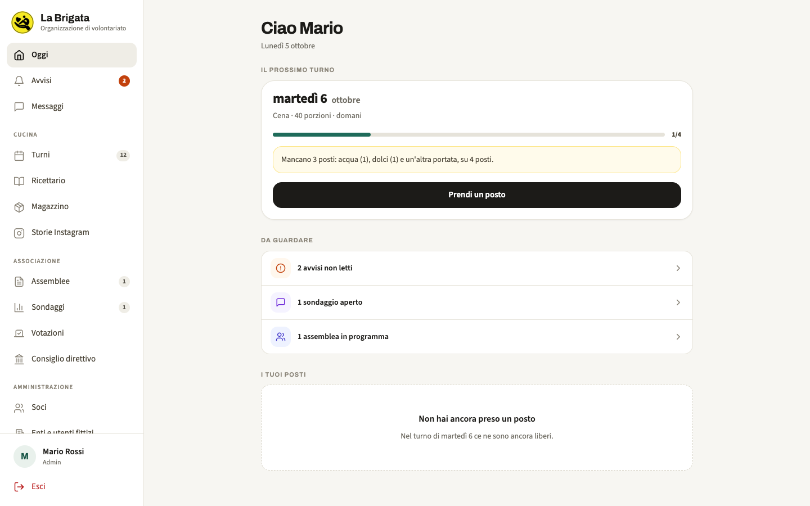
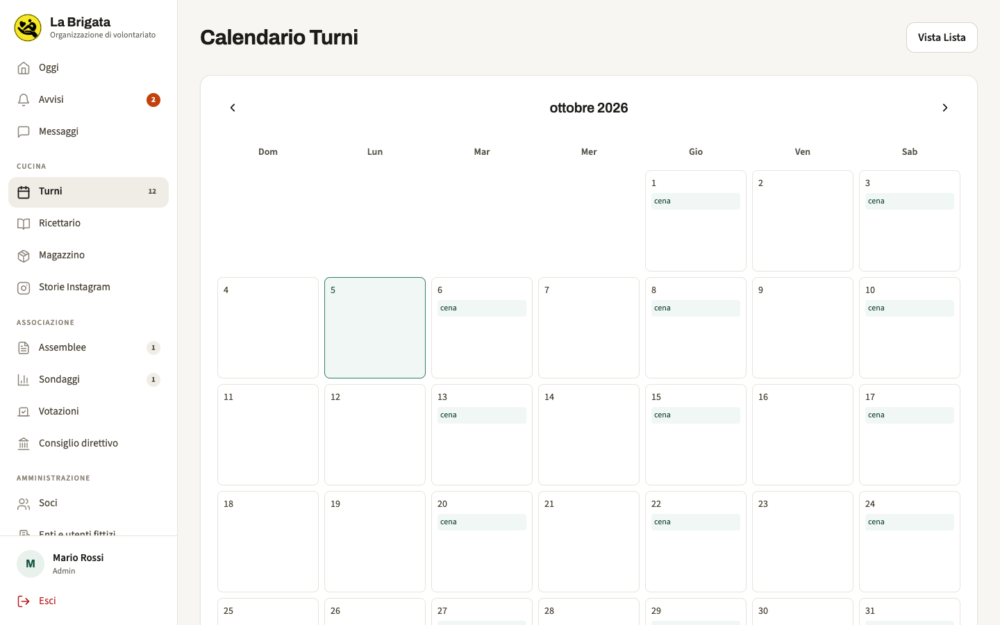
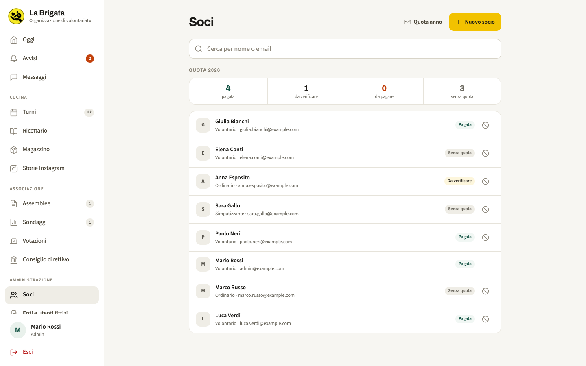
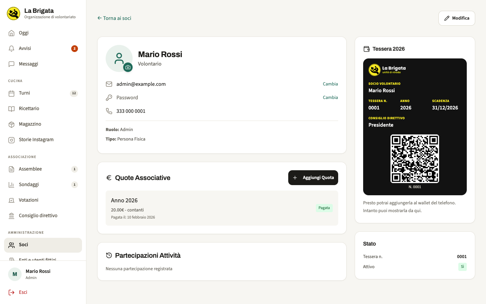
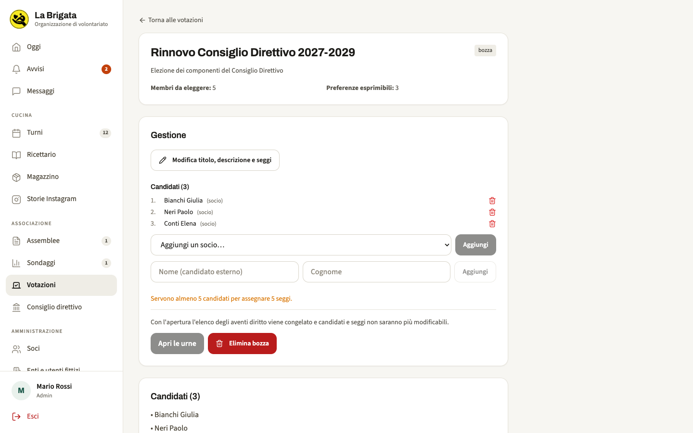
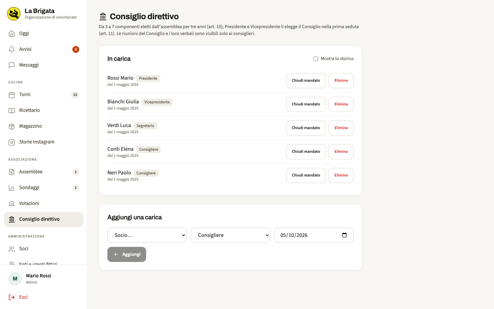
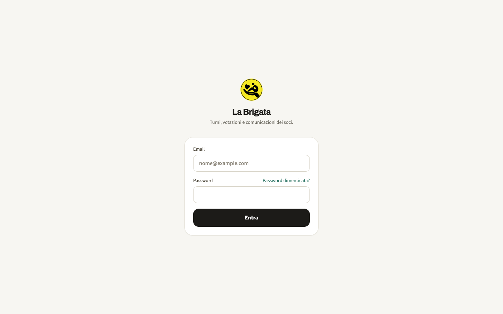
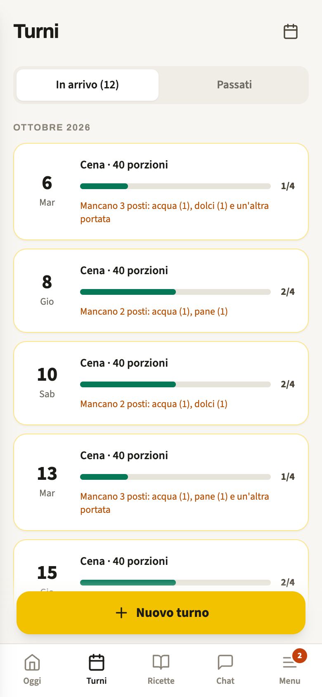

# La Brigata ODV — gestionale dell'associazione

Applicazione web (e app mobile) usata dall'associazione di volontariato La Brigata ODV di Salerno, che opera in strada a sostegno delle persone senza dimora. Serve a organizzare i turni in cucina, tenere il libro soci e le quote, convocare le assemblee, gestire votazioni e Consiglio direttivo e comunicare tra soci.

Gli screenshot qui sotto sono stati presi da un'istanza locale con soli dati di prova inventati.



## Funzionalità

### Cucina e turni
- Turni di cucina (colazione, pranzo, cena) con slot per portata: primi, dolci, pane, acqua e così via; ogni socio prende un posto o l'admin lo assegna.
- Vista elenco e calendario mensile, con evidenza dei posti ancora scoperti.
- **Sondaggi WhatsApp per i turni**: l'app pubblica un sondaggio in un gruppo WhatsApp (tramite [Evolution API](https://github.com/EvolutionAPI/evolution-api)) e un webhook converte i voti in posti assegnati, riconciliando aggiunte e ritiri. Lo script `scripts/ferma-sondaggi.sh` chiude d'emergenza tutti i sondaggi aperti.
- **Calendario pubblico** in sola lettura, raggiungibile senza account tramite un link con codice segreto rigenerabile dalle impostazioni.
- **Ricettario** collegabile agli slot, con ricette globali o legate al singolo turno.
- **Storie Instagram**: genera immagini pronte per le storie a partire dagli slot ancora liberi.

### Soci e quote
- Libro soci: persone fisiche ed enti, categorie (volontario, ordinario, simpatizzante…), sospensione, foto profilo, storico modifiche, partecipazioni.
- Enti e utenti "fittizi" per anagrafiche che non accedono all'app (ad esempio chi vota sul sondaggio WhatsApp senza avere un account).
- Quote associative: registrazione manuale, pagamento con **PayPal** (create/capture lato server) oppure segnalazione di un pagamento fatto altrove, che l'admin poi valida o rifiuta. Invio massivo dell'invito a pagare la quota dell'anno.
- **Tessera socio digitale**: spetta a chi è in regola con la quota dell'anno; mostra numero, categoria ed eventuale carica, con un QR che porta a una pagina pubblica di verifica dello stato attuale. Integrazione opzionale con Apple Wallet e Google Wallet (attiva solo se configurata).

### Vita associativa
- Assemblee: convocazioni via email, avviso di convocazione in PDF, presenze con esportazione, verbale e allegati.
- **Votazioni** per il rinnovo degli organi sociali: candidati (soci o esterni), apertura e chiusura delle urne, affluenza, scrutinio, esportazione. Il voto è segreto per costruzione: chi ha votato e cosa ha votato stanno in tabelle non ricollegabili. Il **verbale** viene generato in PDF con un hash SHA-256 dei dati di scrutinio.
- **Consiglio direttivo**: cariche (presidente, vicepresidente, segretario, consiglieri) con date di mandato, anche importate dall'esito di una votazione; verbale delle riunioni del Consiglio in PDF.
- Sondaggi interni con risposta singola o multipla, risultati ed export CSV.
- Carta intestata configurabile (logo) applicata ai PDF generati.

### Comunicazione
- Avvisi in bacheca con priorità, destinatari e conferma di lettura.
- **Chat interna** con conversazioni dirette e gruppi (foto del gruppo, partecipanti), allegati, modifica ed eliminazione dei messaggi e **cifratura end-to-end** lato browser (ECDH + AES-GCM con Web Crypto API). Dettagli in `docs/E2E_ENCRYPTION.md`.
- Notifiche via email (SMTP) e, se configurato, WhatsApp.
- Raccolta delle richieste arrivate dai form.

### Altro
- Magazzino beni (coperte, igiene, abbigliamento…) con movimenti, scorte minime e donazioni.
- Sportelli specialistici con beneficiari, appuntamenti e interventi.
- Impostazioni modificabili da interfaccia, con storico delle modifiche.
- Monitoraggio errori opzionale con Sentry (backend e frontend).

## Screenshot

| Calendario turni | Libro soci e stato quote |
|---|---|
|  |  |
| **Scheda socio con tessera digitale** | **Votazione in preparazione** |
|  |  |
| **Consiglio direttivo** | **Accesso** |
|  |  |

Da telefono (turni e pagina pubblica di verifica della tessera):

<p>
  
  
</p>

## Architettura

| Parte | Tecnologie |
|---|---|
| Backend | Node.js, Express 4, Sequelize (query SQL dirette) su PostgreSQL, JWT, helmet, rate limiting, multer, nodemailer, pdfkit, passkit-generator |
| Frontend | React 18 + TypeScript, Vite 5, Tailwind CSS, TanStack Query, React Router |
| App mobile | Capacitor 8 (Android e iOS) sullo stesso frontend; build CI su Codemagic (`codemagic.yaml`) |
| Integrazioni opzionali | PayPal, Evolution API (WhatsApp), Apple/Google Wallet, Sentry, SMTP |

```
backend/
  src/
    routes/        # rotte Express, montate su /api/v1/*
    controllers/   # logica delle singole aree
    services/      # sondaggi WhatsApp
    utils/         # scrutinio, verbali PDF, tessera, carta intestata, whatsapp…
    middleware/
    database/      # schema.sql, migrations/, script di setup
  tests/           # jest: unit e integration
frontend/
  src/pages/       # una pagina per area (Turni, Soci, Votazioni, Messaggi…)
  src/components/
  src/services/    # auth, cifratura E2E, monitoraggio
  android/ ios/    # progetti nativi Capacitor
docs/              # architettura, schema DB, API, deployment, privacy, E2E
scripts/           # utilità operative (report settimanale, stop sondaggi)
docker-compose.prod.yml
```

## Avvio in locale

Prerequisiti: Node.js 18+ (la CI usa Node 22) e PostgreSQL 14+.

### Database

`backend/src/database/schema.sql` crea le tabelle di base; le modifiche successive sono in `backend/src/database/migrations/`, da applicare in ordine numerico:

```bash
createdb labrigata_db
psql -d labrigata_db -f backend/src/database/schema.sql
for f in backend/src/database/migrations/*.sql; do psql -d labrigata_db -f "$f"; done
```

In alternativa `npm run setup` (dalla cartella `backend`) crea il database, applica `schema.sql` e chiede i dati del primo admin; le migration vanno comunque applicate dopo. `npm run migrate -- <file.sql>` esegue una singola migration.

### Backend

```bash
cd backend
npm install
cp .env.example .env   # credenziali DB, JWT_SECRET, SMTP, FRONTEND_URL…
npm run dev            # nodemon su http://localhost:3000
```

Variabili opzionali non presenti in `.env.example`: `PAYPAL_CLIENT_ID`, `PAYPAL_CLIENT_SECRET`, `PAYPAL_ENV`, `EVOLUTION_API_URL`, `EVOLUTION_API_KEY`, `EVOLUTION_INSTANCE`, `WHATSAPP_WEBHOOK_TOKEN`, `SENTRY_DSN`, `APPLE_WALLET_*`, `GOOGLE_WALLET_ISSUER_ID`. Senza di esse le relative funzioni restano semplicemente disattivate.

### Frontend

Il frontend non ha un `.env.example`: per default chiama `http://localhost:3000/api/v1`. Per puntare altrove si imposta `VITE_API_URL` (e facoltativamente `VITE_SENTRY_DSN`) in un file `.env.local`.

```bash
cd frontend
npm install
npm run dev            # Vite su http://localhost:3001
npm run build          # build di produzione in dist/
```

### App mobile

```bash
cd frontend
npm run cap:sync       # build in modalità "capacitor" + npx cap sync
npx cap open android   # oppure: npx cap open ios
```

La modalità `capacitor` legge `frontend/.env.capacitor`, che contiene l'URL dell'API di produzione: va adattato prima di compilare per un'altra istanza.

### Test

```bash
cd backend
npm run test:unit
npm run test:integration
```

I test di integrazione ricreano un database dedicato partendo da un container Docker PostgreSQL (vedi `backend/tests/helpers/testDb.js` e le variabili `TEST_DB_*`).

## Ruoli

- **admin**: accesso completo, compresi libro soci, quote, assemblee, votazioni e impostazioni.
- **gestore_cucine**: crea e modifica i turni, assegna gli slot e cura il ricettario, senza accesso a soci, quote e impostazioni.
- **socio_volontario**: può prendere e liberare i posti nei turni.
- **socio_ordinario** e **simpatizzante**: avvisi, chat, sondaggi e votazioni a cui sono destinatari.

## Documentazione

- `docs/architettura.md`, `docs/database-schema.md`, `docs/api-documentation.md`
- `docs/deployment.md`, `docs/TROUBLESHOOTING.md`
- `docs/E2E_ENCRYPTION.md`, `docs/COME_VERIFICARE_E2E.md`
- `docs/privacy-e-trattamento-dati.md`, `docs/flussi-socio.md`

Alcuni documenti sono stati scritti nelle prime fasi del progetto e possono non riflettere ogni dettaglio attuale; in caso di dubbio fa fede il codice.

## Licenza

Tutti i diritti riservati — codice pubblicato a scopo di consultazione.
